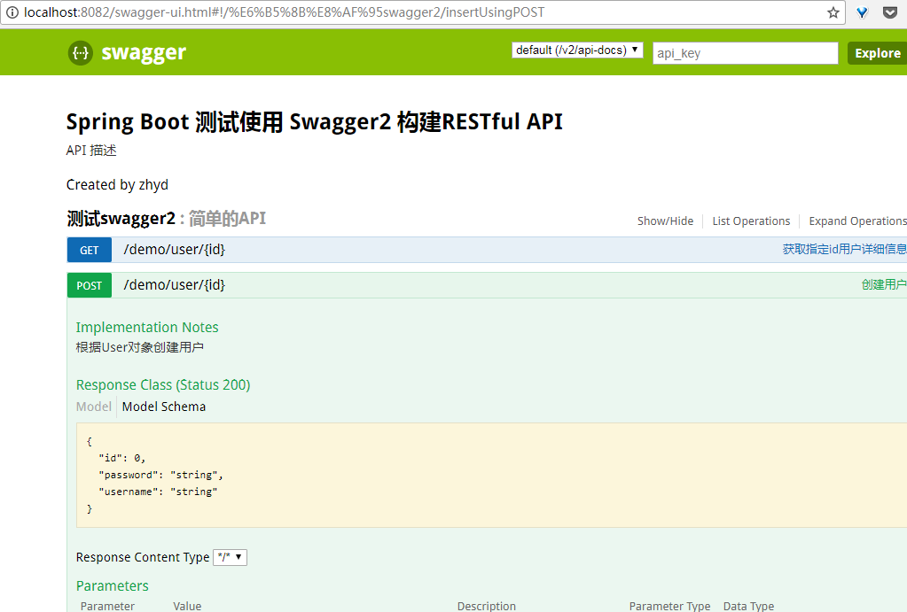
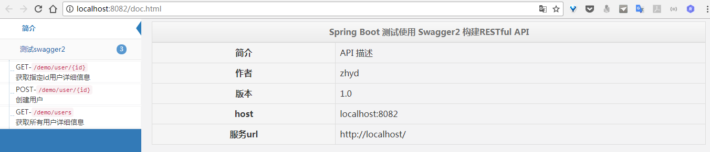
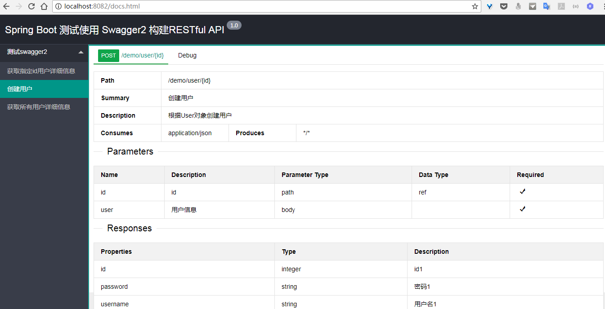
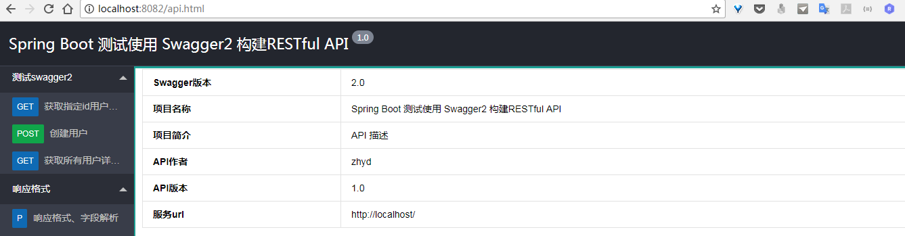

# swagger Restful文档生成工具 2017-9-30

官方地址：[https://swagger.io/docs/specification/about/](https://swagger.io/docs/specification/about/)    

官方Github：[https://github.com/swagger-api/swagger-core/wiki/Annotations](https://github.com/swagger-api/swagger-core/wiki/Annotations)

启动项目，访问[http://localhost:8082/swagger-ui.html](http://localhost:8082/swagger-ui.html)查看API

注意，此项目示例中，使用了三种ui依赖，每种依赖对应的访问页面不同：
```
springfox-swagger-ui -> http://localhost:8082/swagger-ui.html    
swagger-bootstrap-ui -> http://localhost:8082/doc.html    
swagger-ui-layer -> http://localhost:8082/docs.html
```


#### 使用方法：
1.添加依赖（springfox-swagger2依赖是必须的，三种ui依赖只需要使用一个就行）

```
<dependency>
    <groupId>io.springfox</groupId>
    <artifactId>springfox-swagger2</artifactId>
    <version>2.2.2</version>
</dependency>
<dependency>
    <groupId>io.springfox</groupId>
    <artifactId>springfox-swagger-ui</artifactId>
    <version>2.2.2</version>
</dependency>
```
2.创建配置文件Swagger2Config.java
```
@EnableSwagger2
@Configuration
public class Swagger2Config {

    @Bean
    public Docket createRestApi() {
        return new Docket(DocumentationType.SWAGGER_2)
                .apiInfo(apiInfo())
                .select()
                //为当前包路径
                .apis(RequestHandlerSelectors.basePackage("com.zyd.controller"))
                .paths(PathSelectors.any())
                .build();
    }

    //构建 api文档的详细信息函数
    private ApiInfo apiInfo() {
        return new ApiInfoBuilder()
                //页面标题
                .title("Spring Boot 测试使用 Swagger2 构建RESTful API")
                .termsOfServiceUrl("http://localhost/")
                //创建人
                .contact("zhyd")
                //版本号
                .version("1.0")
                //描述
                .description("API 描述")
                .build();
    }
}
```
*注：``@EnableSwagger2``注解一定不要漏掉*

3.编写文档
```
@RestController
@RequestMapping("/demo")
@Api(value = "测试Swagger2",description="简单的API")
public class UserController {

    @ApiOperation(value = "创建用户", notes = "根据User对象创建用户")
    @ApiImplicitParams({
            @ApiImplicitParam(dataType = "java.lang.Long", name = "id", value = "id", required = true, paramType = "path"),
            @ApiImplicitParam(dataType = "User", name = "user", value = "用户信息", required = true)
    })
    @ApiResponses({
            @ApiResponse(code = 500, message = "接口异常"),
    })
    @RequestMapping(value = "/user/{id}", method = RequestMethod.POST)
    public User insert(@PathVariable Long id, @RequestBody User user) {

        System.out.println("id:" + id + ", user:" + user);
        user.setId(id);

        return user;
    }
}
```


注意：如果api文档只是针对开发人员使用的，就需要后台对*v2/api-docs*路径进行过滤，对非开发人员应该是不可见的。

#### 自定义api页面

本例是使用的swagger-ui-layer主题（链接请见本文最后）。使用自定义api页面就不需要在pom中配置ui依赖了，详情查看static目录    

api页面访问地址：[http://localhost:8082/api.html](http://localhost:8082/api.html)

#### 页面效果参考

swagger-ui.html    


bootstrap-ui.html    


layer-ui.html.html    


layer-ui-custom.html   


#### 参考链接

swagger-ui-layer地址：[https://github.com/caspar-chen/swagger-ui-layer](https://github.com/caspar-chen/swagger-ui-layer)   

Swagger-Bootstrap-UI地址：[https://github.com/xiaoymin/Swagger-Bootstrap-UI](https://github.com/xiaoymin/Swagger-Bootstrap-UI)   


## 生命不息，折腾不止！
### 更多信息，请关注：
1. [我的博客](http://www.zhyd.me)
2. [我的工具](http://tool.zhyd.me)
3. [我的微博](http://weibo.com/211230415)
4. [我的头条号](http://www.toutiao.com/c/user/3286958681/)
5. [我的mooc](http://www.imooc.com/u/1175248/articles)

### 有任何问题可以
- [new issue](https://github.com/zhangyd-c/springboot/issues)
- [给我留言](http://www.zhyd.me/guestbook)

### 如果喜欢，请多多分享、多多Star